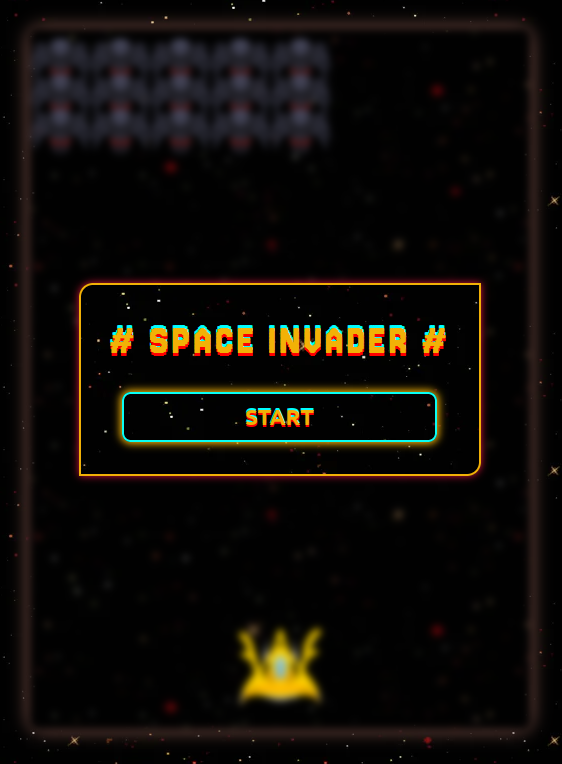

# Space Invader Game

## Overview

Space Invader is a classic arcade-style game built using HTML, CSS, and JavaScript. The game challenges players to defend Earth from waves of alien invaders by controlling a spaceship and shooting down enemies. The game is designed to be fast-paced and increasingly difficult with each new wave.

## Technologies Used

- **HTML**: Structure of the game (Canvas for rendering)
- **CSS**: Styling of the game interface
- **JavaScript**: Game logic, animations, and user input
- **requestAnimationFrame**: For smooth and efficient animations
- **getBoundingClientRect**: Used to detect collisions between elements (spaceship, bullets, invaders)

## Features

- **Spaceship movement**: Move left or right with keyboard controls.
- **Shooting mechanics**: Shoot projectiles to destroy invaders.
- **Collision detection**: Detects hits between the player's bullets and the invaders using `getBoundingClientRect`.
- **Game over condition**: The game ends if the invaders reach the bottom of the screen or the player’s spaceship is hit.
- **Score tracking**: Player's score is displayed at the top of the screen.

## Gameplay Instructions

1. **Start the game**: Open the game in your web browser.
2. **Control the spaceship**: Use the left and right arrow keys to move your spaceship.
3. **Shoot**: Press the spacebar to fire a bullet at the invaders.
4. **Defeat the invaders**: Shoot down as many invaders as possible to increase your score.
5. **Game Over**: If an invader reaches the bottom of the screen or if your spaceship is hit, the game ends.
6. **Restart the game**: Refresh the page to start a new game after losing.

## How to Run the Game Locally

1. Download the repository to your local machine or clone it using Git:

   ```bash
   git clone https://github.com/MohcineDev/PAC.git

<div align="center">

</div>